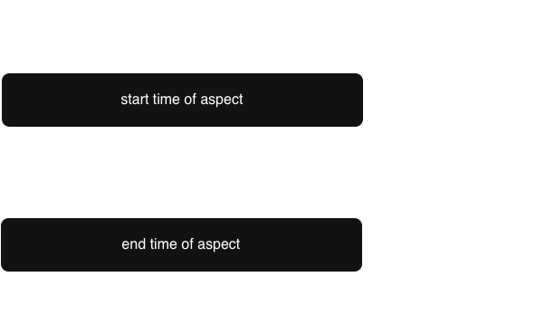

# Aspect-Oriented Programming (AOP)
Aspect-Oriented Programming (AOP) 切面導向程式設計 - 透過切面，統一的去處理方法之間的共同邏輯

```java
@Component
public class HpPrinter implements Printer{

    @Override
    public void print(String message){
        // additional code for computing the time for printing
        Date start = new Date();

        System.out.println("HP 印表機： " + message);

        // additional code for computing the time for printing

        Date end = new Date();
        long time = end.getTime() - start.getTime();
         System.out.println("總共執行了 " + time + " ms");
    }
}
```
Suppose we also want a method, `printColor()`, in HpPrinter to compute the amount of time spent to print color, we need to copy paste the additional code to `printColor()`, too.



### load Spring AOP function
Load AOP function through `pom.xml` dependency

Remember to click refactor "M" button, this will rerun and update your spring boot program.

```xml
<dependencies>
    <dependency>
        <groupId>org.springframework.boot</groupId>
        <artifactId>spring-boot-starter-aop</artifactId>
    </dependency>
</dependencies>
```

## Create a aspect: @Aspect
To create a new aspect, add a `@Aspect` annotation on top of class.

The prerequisite of using @Aspect, is the class has to be defined as a bean object. Therefore, we use `@Aspect` and `@Component` together.

## Execute the aspect before the entry point: @Before
After creating the aspect class, we can write the method of cutting this class.

`@Before` - tells spring to execute the aspect method before the cutting point


The annotation added in `@Before()` specifies the timing point of execution of aspect method.

```java
@Aspect
@Component
public class MyAspect{
    
    @Before("execution(method A)")
    public void before(){
        // method B
    }
}
```
- order of execution:
    method B $\rightarrow$ method A

## Using of other timing points: @After, @Around

`@After` - tells spring to execute the aspect method after the cutting point

`@Around` - tells spring to execute the aspect method "before" and "after" execution cutting point


```java
@Aspect
@Component
public class MyAspect{
    
    @After("execution(method A)")
    public void after(){
        // method B
    }
}
```
- order of execution:
    method A $\rightarrow$ method B


## How to write a PointCut
| PointCut Expression                             | Meaning                                                                                    |
|-------------------------------------------------|--------------------------------------------------------------------------------------------|
| execution(* com.example.demo.HpPrinter.*(..)))  | the cutting point is all the methods within HpPrinter class of  `com.example.demo` package |
| execution(* com.example.demo.*(..))             | the cutting point is all the class methods in `com.example.demo` package                   |
| execution(* com.example.demo..*(..))            | the cutting point is the class methods of `com.example.demo package` and its subpackages   |
| execution(* com.example.demo.HpPrinter.print()) | the cutting pint is the `print()` method of com.example.demo.HpPrinter class               |
| @annotation(com.example.demo.MyAnnotation)      | entry point for the thread                                                                 |

