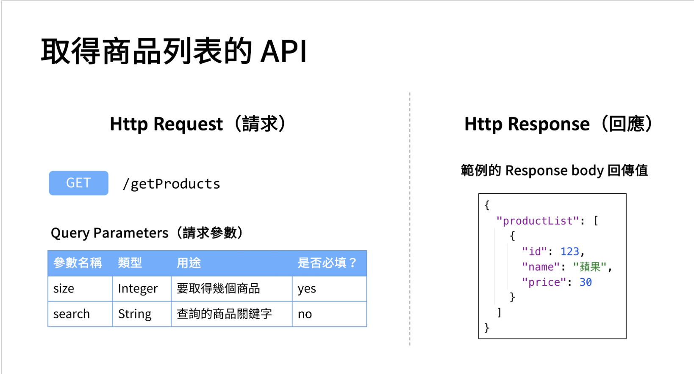

# MVC
When we browse a webpage, it displays the result of combining  frontend's layout with backend's data processing.

Spring MVC is designed to solve the communication between frontend and backend.

## HTTP Protocol
Http protocol is responsible for defining the format of data transmission, such that frontend and backend can communicate effectively.

Http 協議規定資料傳輸的格式，讓前端與後端能有效地進行資料溝通

A complete Http communication involves two parts:
- Http Request: frontend asks data from backend
- Http Response: backend respond/return data to frontend

### Format of HTTP Request
There are 4 components in a HTTP Request,
- Http Method
- URL
- Request Header
- Request Body

HTTP Method:
- GET, POST, PUT, DELETE

URL:
- `http://localhost:8080/test`

Request Header:
- put some general arguments in request statement

Request Body:
- pass the arguments for a HTTP request

HTTP Status Code:
- express the result of HTTP Request

Response Body:
- pass the data for returning backend to frontend


### URL 路徑對應 - @RequestMapping
拆解 url: https://www.instagram.com/p/CHNDtIVl_BS
- 使用協議：https
- 域名： www.instagram.com
- 路徑： /p/CHNDtIVl_BS

@RequestMapping 對應 url 路徑：

e.g. http://localhost:8080/test
    其對應 url 路徑為 `/test`

```java
@RestController
public class MyController{
    @RequestMapping("/test")
    public String test(){
        System.out.println("Hi!");
        return "Hello, World!";
    }
}
```
- @RequestMapping 生效條件：
    - 欲對應 url 路徑的class 必須為 @RestController 或 @Controller

該程式邏輯：觸發 http://localhost:8080/test  路徑中 /test時，會發送請求給 spring boot 執行 test()，並回傳 "Hello, wolrd!" 給前端


### 結構化呈現數據
json 是一種數據呈現的格式，目的是為了「更簡單、更直覺化的方式去呈現」，json 的 key 必須用 "" 雙括號表示

e.g. 我的學號是123, 名字是judy, 可以用以下方式表現
```json
{
    "id": 123,
    "name": "judy"
}

```
json 中 list 概念
```json
{
    "appleList": ["apple1", "apple2", "apple3"]
}
```

## Use Json as Return Value
1. add @RestController on top of a class
2. change the return type to a "java object"

```java
@RestController
public class MyController{
    

    public String product(){
        return "First, an apple. Second, a banana."
    }


    @RequestMapping("/test")
    public Student test(){
        Student student = new Student();
        student.setId(123);
        student.setName("Judy");
        return student;
    }
}
```

Before we return a Student object, we need to define a Student class.
```java
public class Student{
    private Integer id;
    private String name;

    public void setId(Integer id){
        this.id = id;
    }

    public void setName(String name){
        this.name = name;
    }

    public Integer getId(){
        return id;
    }

    public String getName(){
        return name;
    }
}
```

Apply the same logic for product():
```java
@RestController
public class MyController{
    
    @RequestMapping("/product")
    public Store product(){
        Store store = new Store();
        List<String> list = new ArrayList();
        list.add("apple");
        list.add("banana");
        store.setProductList(list);
        return store;
    }


    @RequestMapping("/test")
    public Student test(){
        Student student = new Student();
        student.setId(123);
        student.setName("Judy");
        return student;
    }
}
```
Store class

```java
public class Store(){
    public List<String> productList;
    public List<String> getProductList(){
        return productList;
    }

    public void setProductList(List<String> productList){
        this.productList = productList;
    }
}
```

**Difference Between @Controller and @RestController**:
@Controller returns the name of frontend template, <br>
@RestController returns JSON type data.

Most developers use @RestController nowadays.


## Common HTTP Methods: GET, POST
`GET` method show the parameter values you passed
`http://localhost:8080/test?id=123&name=Judy`

`POST` method hides the parameter values you passed
`http://localhost:8080`
and request body
```json
{
    "id": 123,
    "name": "judy"
}
```
## Request Parameters
1. @RequestParam - receives the parameters that are in the url
2. @RequestBody - receives java object in request body


    ```java
    @RestController
    public class MyController{
        
        @RequestMapping("/test")
        public String test(@RequestParam Integer id){
            System.out.println("id 值為: " + id);
            return "請求成功“;
        }
    }
    ```
    == `http://localhost:8080/test?id=123`


    ```java
    @RestController
    public class MyController{

        @RequestMapping("/test")
        public String test(@RequestBody Student student){
            System.out.println("student id: "+ student.getId());
            System.out.println("student name: "+ student.getName());
            return "successful request";
        }
    }
    ```
3. @RequestHeader - receives the request header value using key-value pair
    - url: `http://localhost:8080/test`
    - request header: `info: hello`
    ```java
    @RestController
    public class MyController{

        @RequestMapping("/test")
        public String test(@RequestHeader String Info){
            System.out.println("info: " + info);
            return "successful request";
        }
    }
    ```
4. @PathVariable - receives the value of url path
    - e.g. `http://localhost:8080/test/123`
    ```java
    @RestController
    public class MyController{

        @RequestMapping("/test/{id}")
        public String test(@PathVariable Integer id){
            System.out.println("info: " + id);
            return "successful request";
        }
    }
    ```

## Comparing @RequestParam and @PathVariable
|                       | @RequestParm                      | @PathVariable                  |
|-----------------------|-----------------------------------|--------------------------------|
| position of parameter | after url path                    | at url path                    |
| annotation            | ?                                 | /                              |
| example               | http://localhost:8080/test?id=123 | http://localhost:8080/test/123 |


**@PathVariable** supports RESTful API design

# Application Programming Interface - API
API - provides a structured, engineering-oriented way to specify how functions are used.



## Restful API
Restful API - An API design that shows Rest style

Conditions of Restful API
1. HTTP methods show DB operations <br>
    Each HTTP method corresponds to DB's operations

    | HTTP Method | DB Operation | Explanation                |
    |-------------|--------------|----------------------------|
    | POST        | Create       | create a new resource      |
    | GET         | Read         | obtain a resource          |
    | PUT         | Update       | update an updated resource |
    | DELETE      | Delete       | delete a resource          |


2. URL path describes levels among resources <br>
    each `/` represent a level of resource

    | HTTP Method + URL path | Explanation               |
    |------------------------|---------------------------|
    | GET `/users`           | obtain users              |
    | GET `/users/123`       | obtain user with id = 123 |

3. Response Body returns JSON or XML format
    ```java
    @RestController
    public class ProductController{
        @RequestMapping("/getProducts")
        public Product getProducts(){
            // ...
        }

    }
    ```