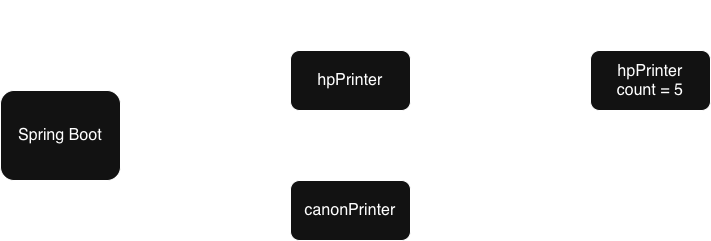

## Bean
Bean is an object that is instantiated, assembled, and managed by a Spring IoC container.
(由 spring 容器所管理的 object 都稱作 bean)

## Container
- `org.springframework.context.ApplicationContext` interface - represents the IoC Container
- the container reads the configuration metadata to instantiate, assemble and manage components


## Dependency Injection (DI)
dependency injection 依賴注入 - 將 bean 物件借給一個class 使用

IoC 必定搭配 DI - IoC 將 object 控制權交出去，後續必須搭配 DI，才能將object 注入回來給我們使用

## Inversion of Control (IoC)
IoC 控制反轉 - 將對 object 的控制權交給 spring 容器管理
當 class 需要使用 object 時，再跟 spring 容器借

e.g.
1. 設計一個印表機 Printer 的 interface，裡面只有一個方法 print()
``` java
public interface Printer {
    void print(String message);
}
```
2. HP 牌子的印表機 / Canon 牌子的印表機，實作 Printer interface
```java
public class HpPrinter implements Printer {

    @Override
    public void print(String message) {
        System.out.println("HP印表機: " + message);
    }
}

public class CanonPrinter implements Printer {

    @Override
    public void print(String message) {
        System.out.println("Canon印表機: " + message);
    }
}
```
3. 設計一個 Teacher class 使用 HpPrinter

```java
public class Teacher {

    private Printer printer = new HpPrinter();

    public void teach() {
        printer.print("I'm a teacher");
    }
}
```

但是假設這個時候，HpPrinter 如果突然壞掉了，那 Teacher 就只能改成去使用 CanonPrinter 印表機，繼續去印東西出來。
我們可能就會產生了一個新的想法：就是身為一個 Teacher，我們其實只是想要一台印表機去印東西而已，不論這個印表機是 HP 還是 Canon 品牌，只要他可以印東西出來就好，我們根本不在意我們所使用的是哪個牌子的印表機。

為了解決上面的「替換印表機」的問題，Spring 就提出了一個新的想法，也就是 「將這個 Printer 的 object（物件）交由 Spring 保管，當誰要使用印表機時，就再去跟 Spring 拿就好」。

```java
public class Teacher {

    private Printer printer;

    public void teach() {
        printer.print("I'm a teacher");
    }
}
```
### Spring IoC 優點
1. Loose Coupling 鬆耦合
    - Spring IoC 可以降低各個 class 之間的關聯性
    - Teacher 就不需要了解這個印表機到底是 HP 牌還是 Canon 牌
2. Lifecycle Management 生命週期管理
    - 統一的生命週期管理
    - Spring 就會負責 HpPrinter 的創建、初始化、以及銷毀，所以就不需要我們親自去處理這件事情
3. More Testable 方便測試程式
    - object 都是由外部的 Spring 容器來做管理，因此我們就可以使用 Mock 的技術，在測試的過程中，將 Spring 容器中的 object 給替換掉，這樣子就可以變免受到其他的外部服務影響

## 創建 bean 的方法： @Component
創建 bean 的方法，在 **class** 上面再加一行 `@Component`

當 spring boot 程式運行起來， spring boot 會去查看哪些 class 上面帶有 `@Component`裝飾，並提前去 new 一個 object 出來放在 spring 容器裡面，等其他人後續來跟它借

注意： 創造出來的 Bean 名字會是 「class 名稱的第一個字母轉小寫」
e.g. `HpPrinter` $\rightarrow$ `hpPrinter`


```java
@Component
public class HpPrinter implements Printer {

    @Override
    public void print(String message) {
        System.out.println("HP印表機: " + message);
    }
}
```
## 注入 bean 的方法: @Autowired
注入 bean 只需要在 **變數** 上加 `@Autowired`
當某個 class 想要注入 bean 進來時， 它本身必須也是個 bean

```java
@Component // Teacher 也是 bean
public class Teacher {

    @Autowired
    private Printer printer; // 注入 bean

    public void teach() {
        printer.print("I'm a teacher");
    }
}
```
`@Autowired` 是根據 「變數類型」 尋找 bean
當我們想要注入一個 Printer 類型的 bean ， spring 容器會查看它裡面有無 Printer 類型的 bean ，假如有將 bean 注入給 class ，否則將出現錯誤並停止程式

## 決定該注入的 bean : @Qualifier
`@Qualifier` - 指定要注入 bean 的名字，解決同時有兩個同樣類型 bean 存在的問題

假設目前在 Spring 容器中有兩個 Bean：hpPrinter 和 canonPrinter，這時候如果我們想要指定要注入 hpPrinter 這個 Bean 的話，那麼就只要在 printer 變數上面，再加上一個 @Qualifier
```java
@Component // Teacher 也是 bean
public class Teacher {

    @Autowired
    @Qualifier("hpPrinter") // 指定要注入的 bean 名字
    private Printer printer; // 注入 bean

    public void teach() {
        printer.print("I'm a teacher");
    }
}
```
`@Qualifier` 使用條件：
1. 搭配 `@Autowired` 代表注入 bean 動作
2. 指定 bean 的名字，記得是 class 名的第一個字母轉成小寫

## bean 的初始化
bean 的初始化 - bean 在被創建出來後，對 bean 做一些初始值的設定

我們建立一個私有變數 count，但並未對其初始化，於是 spring container 預設值賦予 0

```java
@Component
public class HpPrinter implements Printer{
    private int count;

    @Override
    public void print(String message){
        count --;
        System.out.println("HP 印表機: " + message);
        System.out.println("剩餘使用次數: " + message);
    }
}
```

`@PostConstruct` 對 bean 進行初始化

```
@PostConstruct
public void initialize(){
    count = 5;
}
```


使用`@PostConstruct`的使用條件：
- method has to be `public`
- method's return type cannot be `void`
- method does not contain parameters
- you can name the method as `setUp()`, `init()`, `initalize()`, ...etc.

## 讀取 Spring Boot 設定檔
spring boot 設定檔位於 `src/main/resources` 資料夾底下的 `application.properties` 檔案

(這是 intellij 在創建 spring boot 專案時自動生成的設定值)

在 properties 語法中，使用 `key=value` 格式來撰寫設定值

`@Value` - initializes a value from `application.properties`
1. 語法
    ```java
    @Value("${xxx}")
    ```
2. `＠Value` 只有在該 class 本身是 bean 或是帶有 `@Configuration` 設定的 class
    - 記得在該 class 加上 `@Component` 

    ```java
    @Component
    public class HpPrinter implements Printer{
        @Value("${count}")
        private int count;

        @Override
        public void print(String message){
            count--;
            System.out.println("HP 印表機: " + message);
            System.out.println("剩餘使用次數: " + message);
        }
    }
    ```

    within `application.properties`

    ```java
    count = 5
    ```
3. 類型必須要一致
4. 可以設定預設值
    ```java
    @Value("${printer.count:XXX}")
    private int count;
    ```

### 兩種設定檔語法
1. `application.properties`
    - `key=value` format
2. `application.yml`
    - `key:value` format

    ```properties
    # application.properties
    count=5
    my.name=John
    my.age=20
    ```

    ```yml
    # application.yml
    count:5
    my:
        name: John
        age: 20
    ```


